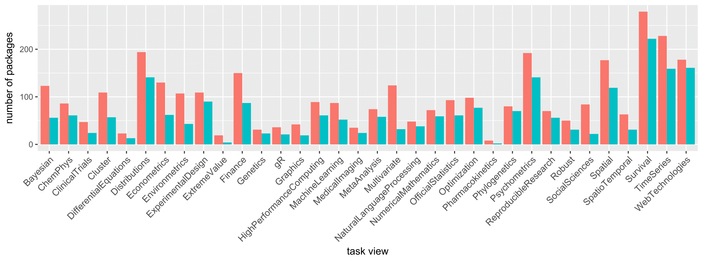

# Taskviews genesis

The usage of the [**taskviews**] (https://github.com/lborke/taskviews) R package  with live examples on GitHub pages

## CRAN Task Views statistics 

Total CRAN packages: **10036**

Total CRAN Task Views: **34**

**The distribution of CRAN task views combinations:**

|Number of task views   |    0|    1|   2|  3|  4|  5|  7|  6|  8|  9| 10|
|:--|----:|----:|---:|--:|--:|--:|--:|--:|--:|--:|--:|
|Number of packages | 7390| 2177| 340| 84| 30|  7|  4|  1|  1|  1|  1|

- **Zero means:** no task view assignment.
- **One:** exactly one task view assignment.
- **More than one:** packages having more than one task view assignment.

**The distribution of all CRAN task views related packages:**

**The distribution of all CRAN task views versus unique CRAN task views:**

## Examples of D3 forceNetwork for CRAN Task Views

**D3 JavaScript force directed network graph visualizing connections between task views:**
- [D3 forceNetwork] (http://bemined.github.io/TaskviewsGenesis/FN_tviews.html) for all task views

**D3 JavaScript force directed network graph visualizing connections between task views and related packages:**
- by task views:
    - [D3 forceNetwork] (http://bemined.github.io/TaskviewsGenesis/FN_some_tviews_1.html) for task views: [WebTechnologies](https://cran.r-project.org/web/views/WebTechnologies.html), [Spatial](https://cran.r-project.org/web/views/Spatial.html), [ReproducibleResearch](https://cran.r-project.org/web/views/ReproducibleResearch.html), [gR](https://cran.r-project.org/web/views/gR.html), [Bayesian](https://cran.r-project.org/web/views/Bayesian.html)
    - [D3 forceNetwork] (http://bemined.github.io/TaskviewsGenesis/FN_some_tviews_2.html) for task views: [Survival](https://cran.r-project.org/web/views/Survival.html), [WebTechnologies](https://cran.r-project.org/web/views/WebTechnologies.html), [Bayesian](https://cran.r-project.org/web/views/Bayesian.html), [Spatial](https://cran.r-project.org/web/views/Spatial.html), [gR](https://cran.r-project.org/web/views/gR.html)
    - [D3 forceNetwork] (http://bemined.github.io/TaskviewsGenesis/FN_some_tviews_3_clickable.html) for task views: [NaturalLanguageProcessing](https://cran.r-project.org/web/views/NaturalLanguageProcessing.html), [WebTechnologies](https://cran.r-project.org/web/views/WebTechnologies.html), [HighPerformanceComputing](https://cran.r-project.org/web/views/HighPerformanceComputing.html). A click on a node takes the user to the webpage with corresponding task view/package.
    - [D3 forceNetwork] (http://bemined.github.io/TaskviewsGenesis/FN_some_tviews_4.html) for the packages belonging to the [HighPerformanceComputing](https://cran.r-project.org/web/views/HighPerformanceComputing.html) task view
- by packages:
    - [D3 forceNetwork] (http://bemined.github.io/TaskviewsGenesis/FN_some_packages.html) for the packages: "abbyyR", "alm", "anametrix", "bigrquery", "downloader", "RgoogleMaps", "plotGoogleMaps", "akima", "cleangeo", "rgdal", "spaMM", "vec2dtransf", "plotKML", "leafletR", "recmap"

